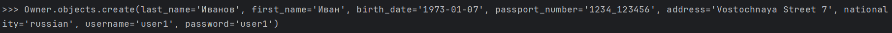
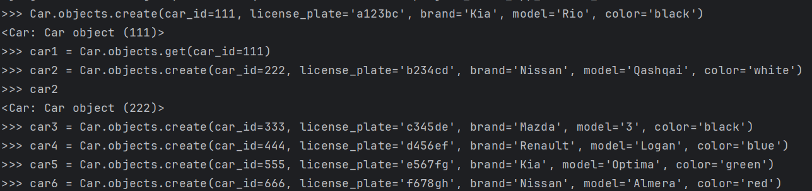
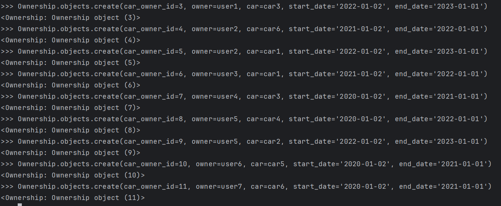
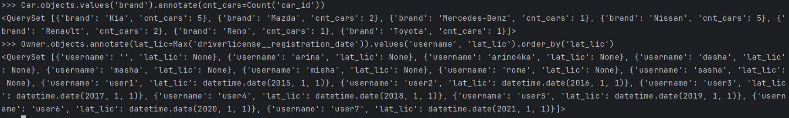

# Практическая 3.1

Запросы
    from project_first_app.models import *
    
    Owner.objects.create(last_name='Петров', first_name='Петр', birth_date='1983-02-06', passport='1234_654321', address='Zapadnaya Street 13', nationality='swiss', username='user2', password='user2')
    Owner.objects.create(last_name='Сидоров', first_name='Сидор', birth_date='1993-03-05', passport='1243_123456', address='Severnaya Street 16', nationality='swedish', username='user3', password='user3')
    Owner.objects.create(last_name='Будин', first_name='Николай', birth_date='1975-04-04', passport='2143_456123', address='Yuzhnaya Street 21', nationality='danish', username='user4', password='user4')
    Owner.objects.create(last_name='Корнеев', first_name='Георгий', birth_date='1985-05-03', passport='1243_123123', address='Karpenko Street 5/7', nationality='welsh', username='user5', password='user5')
    Owner.objects.create(last_name='Станкевич', first_name='Андрей', birth_date='1995-06-02', passport='1432_345123', address='Alekseevskaya Street 3', nationality='irish', username='user6', password='user6')
    Owner.objects.create(last_name='Трифонов', first_name='Петр', birth_date='2000-07-01', passport='4321_456654', address='Galibova Street 1', nationality='dutch', username='user7', password='user7')
    
    user1 = Owner.objects.get(username='user1')
    user2 = Owner.objects.get(username='user2')
    user3 = Owner.objects.get(username='user3')
    user4 = Owner.objects.get(username='user4')
    user5 = Owner.objects.get(username='user5')
    user6 = Owner.objects.get(username='user6')
    user7 = Owner.objects.get(username='user7')
    
    DriverLicense.objects.create(license_id=1, owner_id=user1, license_number='123', type='c', registration_date='2015-01-01')
    DriverLicense.objects.create(license_id=2, owner_id=user2, license_number='234', type='b', registration_date='2016-01-01')
    DriverLicense.objects.create(license_id=3, owner_id=user3, license_number='345', type='b', registration_date='2017-01-01')
    DriverLicense.objects.create(license_id=4, owner_id=user4, license_number='456', type='a', registration_date='2018-01-01')
    DriverLicense.objects.create(license_id=5, owner_id=user5, license_number='567', type='a', registration_date='2019-01-01')
    DriverLicense.objects.create(license_id=6, owner_id=user6, license_number='678', type='c', registration_date='2020-01-01')
    DriverLicense.objects.create(license_id=7, owner_id=user7, license_number='789', type='a', registration_date='2021-01-01')
    
    car1 = Car.objects.create(car_id=111, license_plate='a123bc', brand='Kia', model='Rio', color='black')
    car2 = Car.objects.create(car_id=222, license_plate='b234cd', brand='Nissan', model='Qashqai', color='white')
    car3 = Car.objects.create(car_id=333, license_plate='c345de', brand='Mazda', model='3', color='black')
    car4 = Car.objects.create(car_id=444, license_plate='d456ef', brand='Renault', model='Logan', color='blue')
    car5 = Car.objects.create(car_id=555, license_plate='e567fg', brand='Kia', model='Optima', color='green')
    car6 = Car.objects.create(car_id=666, license_plate='f678gh', brand='Nissan', model='Almera', color='red')
    
    Ownership.objects.create(car_owner_id=1, owner=user1, car=car1, start_date='2020-01-02', end_date='2021-01-01')
    Ownership.objects.create(car_owner_id=2, owner=user1, car=car2, start_date='2021-01-02', end_date='2022-01-01')
    Ownership.objects.create(car_owner_id=3, owner=user1, car=car3, start_date='2022-01-02', end_date='2023-01-01')
    Ownership.objects.create(car_owner_id=4, owner=user2, car=car6, start_date='2021-01-02', end_date='2022-01-01')
    Ownership.objects.create(car_owner_id=5, owner=user2, car=car1, start_date='2022-01-02', end_date='2023-01-01')
    Ownership.objects.create(car_owner_id=6, owner=user3, car=car1, start_date='2021-01-02', end_date='2022-01-01')
    Ownership.objects.create(car_owner_id=7, owner=user4, car=car3, start_date='2020-01-02', end_date='2021-01-01')
    Ownership.objects.create(car_owner_id=8, owner=user5, car=car4, start_date='2020-01-02', end_date='2022-01-01')
    Ownership.objects.create(car_owner_id=9, owner=user5, car=car2, start_date='2022-01-02', end_date='2023-01-01')
    Ownership.objects.create(car_owner_id=10, owner=user6, car=car5, start_date='2020-01-02', end_date='2021-01-01')
    Ownership.objects.create(car_owner_id=11, owner=user7, car=car6, start_date='2020-01-02', end_date='2021-01-01')
    
    Cars.objects.filter(brand='Kia')
    Owner.objects.filter(first_name='Петр')
    DriverLicense.objects.get(owner_id=user1)
    Owner.objects.filter(car__color='black')
    Owner.objects.filter(ownership__start_date__gte='2022-01-01')

Создание владельцев

Создание машин

Создание лицензий

Создание владения автомобилем

Задания

